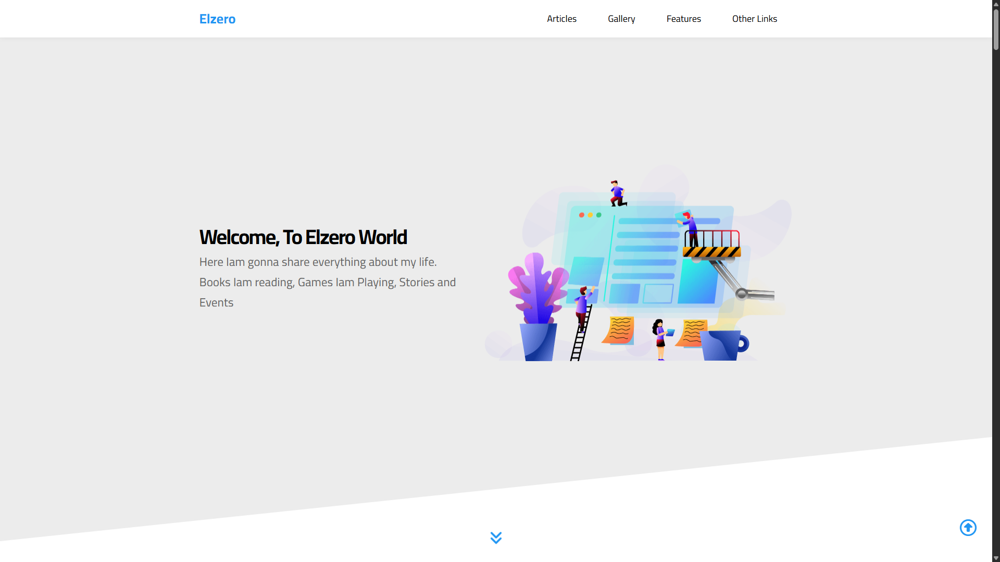

# 🌐 HTML & CSS Single Page Website

A clean and structured **single-page website** built using **HTML5** and **CSS3** only.  
This project is part of my HTML/CSS learning journey and demonstrates how to create a multi-sectioned webpage using only core web technologies — without any framework or library.

---

## 🚀 Live Demo

📍 [View Live](https://abd-el-rahman-adel-dev.github.io/HTML_CSS_third_Project/)

---

## 📸 Screenshot




> 📝 *Make sure to add these images in a `screenshots/` folder or update the paths accordingly.*

---

## ✨ Features

- 🎨 Fully static layout using pure HTML & CSS
- 📄 Multi-section navigation (single-page)
- 🧭 Smooth anchor links to each section
- 🎂 Birthday and hobbies section
- 🌍 Slider-like section for favorite countries *(implemented using pure CSS)*
- 💬 Contact form layout
- 👤 CV-like profile section

---

## 🛠 Tech Stack

- **HTML5**
- **CSS3**

> 💡 No JavaScript, no libraries — pure and lightweight.

---

## 📦 Getting Started

To run the project locally:

```bash
git clone https://github.com/abd-el-rahman-adel-dev/HTML_CSS_third_Project.git
cd HTML_CSS_third_Project
open index.html
```

Or just double-click `index.html` in your file manager.

---

## 📁 Project Structure

```
📦 HTML_CSS_third_Project
┣ 📂 css
┃ ┗ 📜 style.css
┣ 📂 images
┣ 📜 index.html

```

---

## 📄 License

This project is licensed under the [MIT License](./LICENSE).

---

## 🙋‍♂️ Author

- [Abd El-Rahman Adel](https://github.com/abd-el-rahman-adel-dev)
- [LinkedIn](https://www.linkedin.com/in/abdelrahman-adel-webdev)

---

> ⭐ If you find this template useful, consider starring the repo and reusing it for your own practice or portfolio.
